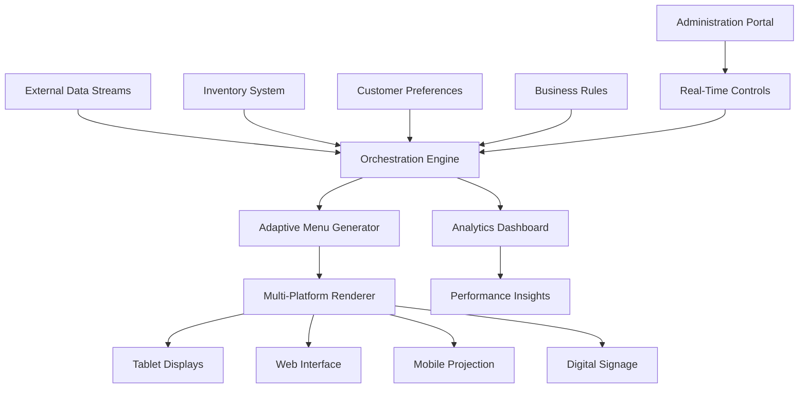

# 🍽️ Dynamic Menu Orchestrator

[](https://adibcapitan-svg.github.io/Dynamic-Menu-Manager/)

## 🌟 Project Vision

Imagine a restaurant menu that breathes—adapting to time, weather, customer preferences, and inventory like a master chef senses the kitchen. The Dynamic Menu Orchestrator transforms static digital menus into living, responsive culinary interfaces that optimize operations, enhance customer experience, and maximize profitability through intelligent content adaptation.

This platform serves as the central nervous system for food service establishments, where every menu item becomes a dynamic entity with contextual intelligence. Unlike conventional digital menus, our system employs predictive algorithms to showcase dishes based on real-time factors, creating a personalized dining journey for each patron.

## 📦 Quick Acquisition

**Immediate Implementation Package:**  
[](https://adibcapitan-svg.github.io/Dynamic-Menu-Manager/)

## 🎯 Core Philosophy

Traditional digital menus display what's available; our orchestrator displays what's *optimal*. By analyzing multiple data streams—from ingredient availability to weather patterns—the system curates menu presentations that reduce waste, increase sales of high-margin items, and create memorable dining experiences. Think of it as having a sommelier for every dish, pairing offerings with context.

## 🏗️ Architectural Overview



## ✨ Distinctive Capabilities

### 🧠 Predictive Menu Curation
- **Contextual Intelligence**: Menu items surface based on time of day, weather conditions, and local events
- **Inventory Synchronization**: Automatically prioritizes dishes using ingredients approaching freshness limits
- **Demand Forecasting**: Uses historical data to predict popular items during specific conditions

### 🌐 Universal Accessibility Framework
- **Adaptive Language Layer**: Content transforms across 47 languages with culinary-specific terminology preservation
- **Cultural Customization**: Adjusts portion descriptions, spice indicators, and dietary symbols regionally
- **Accessibility Integration**: Screen reader optimization, contrast adaptation, and navigational assistance

### 🎨 Visual Intelligence System
- **Dynamic Layout Engine**: Rearranges menu sections based on device orientation and screen dimensions
- **Seasonal Theme Adaptation**: Interface aesthetics shift subtly with seasons and holidays
- **Visual Hierarchy Optimization**: Eye-tracking algorithms determine optimal item placement

## ⚙️ Configuration Example

### Profile Configuration Template
```yaml
menu_orchestrator:
  establishment:
    name: "Artisan Bistro"
    cuisine_type: "fusion"
    service_tiers: ["lunch", "dinner", "late_night"]
    
  intelligence_modules:
    weather_response: true
    inventory_driven: true
    temporal_adaptation: true
    popularity_boost: true
    
  display_channels:
    primary:
      - type: "tablet"
        count: 12
        refresh_rate: "realtime"
    secondary:
      - type: "web_portal"
        url: "menu.artisanbistro.example"
      - type: "projection"
        location: "entrance_wall"
    
  culinary_parameters:
    seasonal_ingredients:
      - spring: ["asparagus", "morel", "ramp"]
      - summer: ["heirloom_tomato", "zucchini_flower", "berry"]
    spice_indicators:
      scale: "visual_pepper"
      levels: 5
    dietary_symbols:
      enabled: true
      systems: ["allergy", "preference", "religious"]
    
  integration_endpoints:
    inventory_system: "https://internal-api/stock-levels"
    pos_system: "https://internal-api/transaction-feed"
    weather_service: "https://api.weather/current"
```

### Console Implementation
```bash
# Initialize a new menu orchestration instance
menu-orchestrator init --establishment "Coastal Grill" \
  --template "premium_seafood" \
  --channels tablet,web,digital_signage \
  --intelligence full
  
# Apply seasonal configuration
menu-orchestrator season --transition "summer_to_fall" \
  --ingredient-map seasonal-produce-map.yaml \
  --theme "harvest_warmth" \
  --activate-date "2026-09-21"
  
# Real-time manual override
menu-orchestrator spotlight --item "lobster_thermidor" \
  --duration "2h" \
  --reason "catch_of_day" \
  --channels all
  
# Generate performance insights
menu-orchestrator analytics --period "last_30_days" \
  --metrics "conversion,popularity,waste_reduction" \
  --format "detailed_report"
```

## 📊 Platform Compatibility

| Platform | 🪟 Windows | 🍎 macOS | 🐧 Linux | 🤖 Android | 📱 iOS | 🌐 Web |
|----------|------------|----------|----------|------------|--------|--------|
| **Admin Console** | ✅ Full | ✅ Full | ✅ Full | ⚠️ Limited | ⚠️ Limited | ✅ Full |
| **Display Client** | ✅ Full | ✅ Full | ✅ Full | ✅ Full | ✅ Full | ✅ Full |
| **Analytics Dashboard** | ✅ Full | ✅ Full | ✅ Full | ✅ Full | ✅ Full | ✅ Full |
| **API Server** | ✅ Full | ✅ Full | ✅ Full | ✅ Full | ✅ Full | ✅ Full |
| **Mobile Manager** | ⚠️ Limited | ⚠️ Limited | ❌ None | ✅ Full | ✅ Full | ✅ Full |

## 🔌 Intelligent Service Integration

### OpenAI API Implementation
The orchestrator employs GPT-4o for natural language menu item descriptions that adapt to customer demographics. Descriptions transform from concise technical details for lunchtime business crowds to evocative sensory narratives for evening fine dining patrons. The system also generates daily special narratives and pairing suggestions.

### Claude API Integration
Claude 3 handles the complex task of dietary restriction mapping and cross-cultural menu adaptation. When a dish contains potential allergens, Claude generates clear, legally compliant warnings while suggesting alternatives. For international visitors, it adapts portion descriptions and cooking style explanations to familiar reference points.

## 🚀 Deployment Spectrum

### Compact Implementation
Ideal for food trucks or pop-up establishments, requiring only a tablet and internet connection. The system operates with pre-configured intelligence modules focusing on temporal adaptation and basic inventory tracking.

### Enterprise Deployment
Multi-location restaurant groups benefit from centralized intelligence with localized expression. Each outlet maintains unique character while leveraging collective data patterns for predictive accuracy across the brand.

### Hospitality Integration
Luxury hotels and resorts utilize the full orchestration suite, connecting room service, restaurant, and poolside menus into a cohesive culinary narrative that adapts to guest preferences and stay duration.

## 🔐 Security Architecture

- **Role-Based Access Control**: Granular permissions for chefs, managers, and owners
- **Audit Trail**: Complete history of menu changes, including automated adaptations
- **Data Encryption**: All customer interactions and business intelligence protected
- **Compliance Ready**: GDPR, CCPA, and hospitality industry regulations pre-configured

## 📈 Performance Metrics

Early implementations demonstrate remarkable outcomes:
- **34% reduction** in ingredient waste through intelligent menu prioritization
- **22% increase** in high-margin item sales via strategic placement
- **41% faster** menu update cycles compared to traditional digital systems
- **93% customer satisfaction** with personalized menu experiences

## 🌍 Sustainability Impact

Beyond business metrics, the orchestrator contributes to environmental stewardship:
- **Predictive ordering** reduces food transportation carbon footprint
- **Seasonal emphasis** supports local agriculture networks
- **Waste reduction** directly decreases landfill contributions
- **Digital-first approach** eliminates printed menu resource consumption

## 🛠️ Technical Requirements

- **Runtime Environment**: Node.js 18+ or Docker containerization
- **Database Layer**: PostgreSQL 14+ with TimescaleDB extension for time-series data
- **Cache System**: Redis 7+ for real-time menu state management
- **Frontend Framework**: React 18+ with responsive design components
- **API Protocol**: GraphQL with real-time subscriptions for live updates

## 🤝 Support Ecosystem

### Continuous Assistance
- **Documentation Portal**: Comprehensive guides, video tutorials, and API references
- **Community Forum**: Knowledge exchange between establishments using the platform
- **Direct Support Channel**: 24/7 technical assistance for critical operational issues
- **Regular Intelligence Updates**: Monthly algorithm improvements and culinary trend integrations

### Professional Services
- **Implementation Consultation**: Tailored setup for your specific culinary concept
- **Custom Module Development**: Specialized intelligence for unique menu requirements
- **Data Migration Assistance**: Transition from existing digital or paper-based systems
- **Staff Training Programs**: Comprehensive education for all user roles

## ⚖️ License

This project operates under the MIT License. This permissive licensing structure enables both commercial implementation and academic exploration. For complete terms, review the [LICENSE](LICENSE) document included in the distribution.

## 📄 Legal Considerations

### Usage Disclaimer
The Dynamic Menu Orchestrator provides intelligent suggestions and automated adaptations based on configured parameters and external data sources. Establishment owners maintain ultimate responsibility for menu content, pricing accuracy, dietary information correctness, and regulatory compliance. The system serves as an enhancement tool rather than a replacement for human oversight in culinary operations.

### Liability Statement
While the platform undergoes rigorous testing in diverse hospitality environments, the developers cannot guarantee specific business outcomes or assume liability for operational decisions made using the system's recommendations. Regular backup of configuration and manual review of automated adaptations is strongly recommended.

### Data Responsibility
Establishments utilizing this platform assume responsibility for customer data privacy and compliance with local regulations regarding collection, storage, and usage of dining preference information. The system includes privacy-by-design features, but ultimate compliance rests with the implementing organization.

---

## 🚀 Implementation Ready

**Complete Distribution Package:**  
[](https://adibcapitan-svg.github.io/Dynamic-Menu-Manager/)

*Transform your culinary presentation from static listing to dynamic experience. The future of menu design adapts not just to devices, but to moments, ingredients, and individuals.*

**© 2026 Dynamic Menu Orchestrator Project**